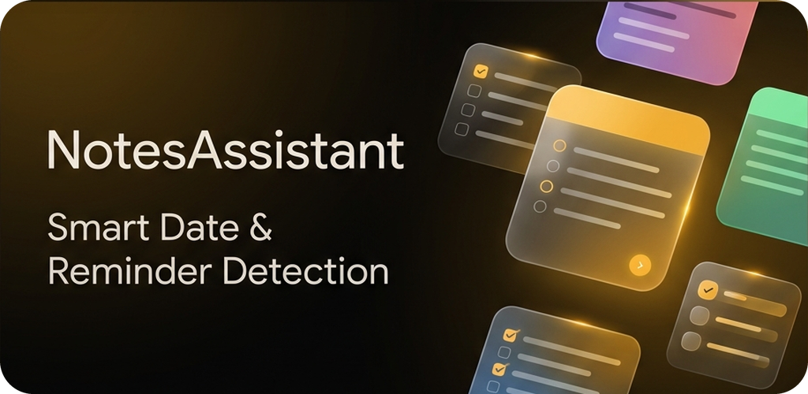
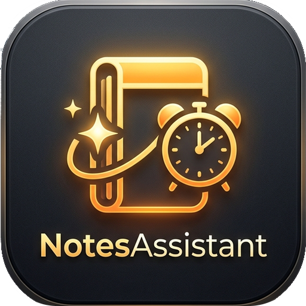

  <h1>NotesAssistant 📝</h1>
  
<strong>A Smart Notes & Checklist App for Android</strong> <em>Android için Akıllı Not & Liste Uygulaması</em>

   

  
    

  
  
  
  
   
  
  

---

## 🇬🇧 English

### Overview
**NotesAssistant** is a modern Android notes and checklist app built with Jetpack Compose. It combines a distraction-free, borderless editor with smart date detection, biometric-locked private notes, and full cross-device sync through the user's own Google Drive account.

### Features
* **Note Taking:** Title + free-text notes with a borderless, Google Keep–style editor.
* **Simple Formatting:** Bold, italic, and headings via lightweight markup (`**bold**`, `*italic*`, `# heading`), with a formatted preview on cards.
* **Checklist:** Checkable items with drag-to-reorder, auto-collecting completed items at the bottom, and one-tap clearing.
* **Labels:** One category label per note (Work, Home, Shopping…) with filter chips on the home screen.
* **Private Notes:** Biometric lock (fingerprint/face/screen lock); locked notes hide their content preview and are excluded from search.
* **Trash:** Deleted notes are kept for 30 days before permanent removal, with restore at any time.
* **Smart Date Detection:** Phrases like "tomorrow 3pm", "monday", or "in 3 days" are detected in note text and converted into a calendar event with one tap.
* **Google Drive Sync:** Notes sync across devices via a private app-data folder in Drive, using a last-edit-wins merge strategy.
* **Backup:** Automatic Android Auto Backup plus manual JSON export/import.
* **Sharing & Shortcuts:** Share notes as text to other apps; long-press the app icon for quick "New note" / "New list".
* **Theme Selection:** Light, Dark, or System.

### Tech Stack
* **Language:** Kotlin
* **UI:** Jetpack Compose, Material 3
* **Architecture:** MVVM, single module
* **Local Storage:** Room (`notes`, `checklist_items`), DataStore Preferences
* **Sync:** Google Drive API (app-data scope) via Play Services Identity/Authorization
* **Security:** AndroidX Biometric for private-note authentication
* **Serialization:** kotlinx.serialization
* **Min SDK:** 26 · **Target SDK:** 36

### Privacy & Security
All secrets (AdMob IDs, signing keystore passwords) are kept out of source control via `local.properties` and are never hardcoded. The project builds successfully even without these keys — it falls back to Google's test ad IDs and an unsigned release — so anyone can clone and build the app. Google Drive sync only ever requests the app-private `drive.appdata` scope; it never has access to the rest of the user's Drive.

---

## 🇹🇷 Türkçe

### Genel Bakış
**NotesAssistant**, Jetpack Compose ile geliştirilmiş modern bir Android not ve liste uygulamasıdır. Sade, çerçevesiz bir editörü; akıllı tarih algılamayı, biyometrik kilitli gizli notları ve kullanıcının kendi Google Drive hesabı üzerinden tam cihazlar arası eşitlemeyi bir araya getirir.

### Özellikler
* **Not Alma:** Google Keep tarzı çerçevesiz editörle başlık + serbest metin notları.
* **Basit Biçimlendirme:** Hafif işaretlemeyle kalın, italik ve başlık (`**kalın**`, `*italik*`, `# başlık`); kartlarda biçimli önizleme.
* **Checklist:** Sürükleyerek sıralanabilen maddeler; tamamlananlar kendiliğinden altta toplanır, tek dokunuşla temizlenir.
* **Etiketler:** Nota tek kategori etiketi (İş, Ev, Alışveriş…); ana ekranda çiplerle filtreleme.
* **Gizli Notlar:** Biyometrik kilit (parmak izi/yüz/ekran kilidi); kilitli notların içerik önizlemesi gizlenir ve aramaya dahil edilmez.
* **Çöp Kutusu:** Silinen notlar kalıcı silinmeden önce 30 gün bekletilir, istenildiği an geri alınabilir.
* **Akıllı Tarih Algılama:** Not metnindeki "yarın 15:00", "pazartesi", "3 gün sonra" gibi ifadeler algılanır ve tek dokunuşla takvim etkinliğine dönüştürülür.
* **Google Drive Eşitleme:** Notlar, Drive'ın uygulamaya özel gizli alanı üzerinden "en son düzenlenen kazanır" mantığıyla cihazlar arası eşitlenir.
* **Yedekleme:** Otomatik Android Auto Backup ve manuel JSON dışa/içe aktarma.
* **Paylaşma & Kısayollar:** Notları metin olarak başka uygulamalara paylaşma; simgeye uzun basarak hızlı "Yeni not" / "Yeni liste".
* **Tema Seçimi:** Açık, Koyu veya Sistem.

### Kullanılan Teknolojiler
* **Dil:** Kotlin
* **Arayüz:** Jetpack Compose, Material 3
* **Mimari:** Tek modül, MVVM
* **Yerel Depolama:** Room (`notes`, `checklist_items`), DataStore Preferences
* **Eşitleme:** Play Services Identity/Authorization üzerinden Google Drive API (app-data kapsamı)
* **Güvenlik:** Gizli not doğrulaması için AndroidX Biometric
* **Serileştirme:** kotlinx.serialization
* **Min SDK:** 26 · **Target SDK:** 36

### Gizlilik & Güvenlik
Tüm gizli değerler (AdMob kimlikleri, imza anahtarı parolaları) `local.properties` aracılığıyla kaynak kod dışında tutulur ve asla doğrudan koda yazılmaz. Proje bu anahtarlar olmadan da sorunsuz derlenir — Google'ın test reklam kimlikleriyle ve imzasız bir release'e düşer — böylece depoyu klonlayan herkes uygulamayı derleyebilir. Google Drive eşitlemesi yalnızca uygulamaya özel `drive.appdata` kapsamını ister; kullanıcının Drive'ının geri kalanına asla erişemez.

---

  

